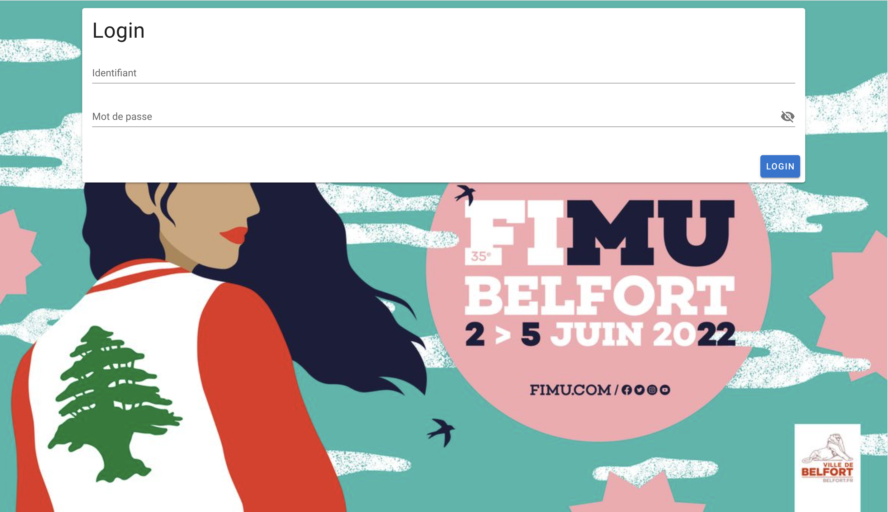
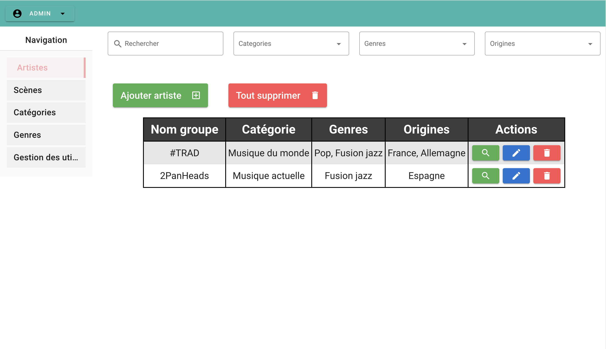

# SAE_FIMU

This project aims to provide a simple and easy to use interface for the [FIMU of Belfort](https://www.fimu.com). It is based on an API we developed in order to communicate with the database.

There are three main parts in this project :
- The API
- The web interface for administrators
- The mobile application for users

Now, the API is almost finished and the web interface is in progress. The mobile application is not started yet.

<br>

## How to install the project and try it

---

### Requirements

- [Node.js](https://nodejs.org/en/)
- [PostgreSQL](https://www.postgresql.org/)
- [Vue-cli](https://cli.vuejs.org/)

### Installation

1. Clone the project

```bash
git clone https://github.com/valentinmougenot/SAE_FIMU.git
```

2. Install the dependencies

```bash
cd SAE_FIMU/API
npm install
cd ../vue
npm install
```

3. Create a database in PostgreSQL

```sql
psql -U login
CREATE DATABASE fimu;
\c fimu
CREATE SCHEMA common;
CREATE SCHEMA currentseason;
CREATE SCHEMA nextseason;
CREATE SCHEMA previousseasons;
\q
```

4. Fill the database with the data

```bash
cd ../Ressources/BDD
./init_db.sh <login> <server>
```

5. Edit the configuration file

```bash
cd ../../API/db
nano db.config.js
```

Replace the username and password with your own.

6. Run the API

```bash
cd ..
npm start
```

7. Run the web interface

```bash
cd ../vue
npm run serve
```

8. Open the web interface

Open your browser and go to [http://localhost:8080/login](http://localhost:8080/login)



The default login is `admin` and the default password is `admin`. You will be logged as an administrator. If you want to log as an editor, you can use the login `editor` and the password `editor`.

And that's it ! You can now try the web interface.


